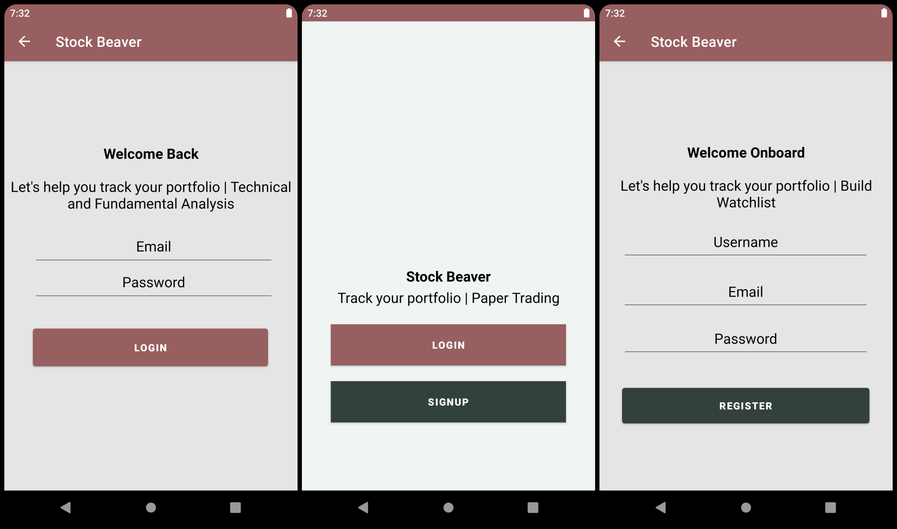
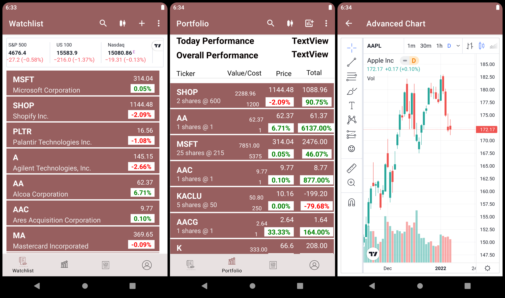
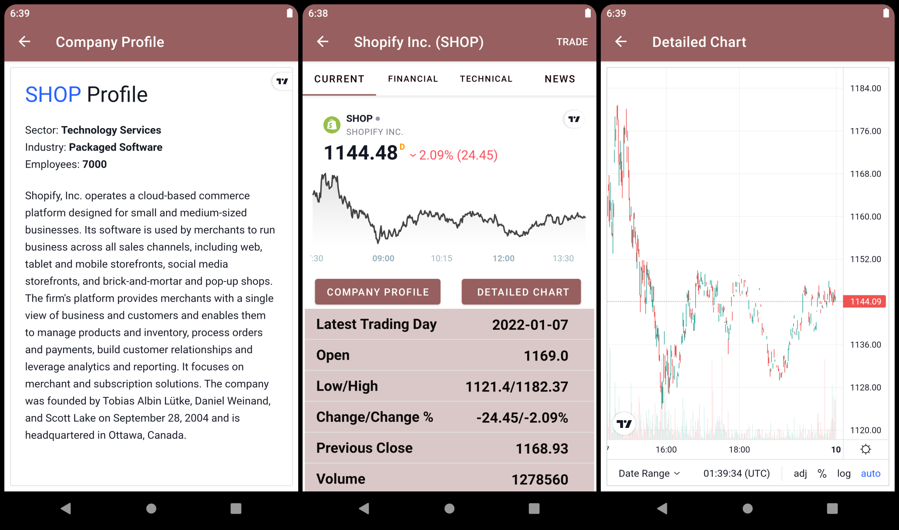
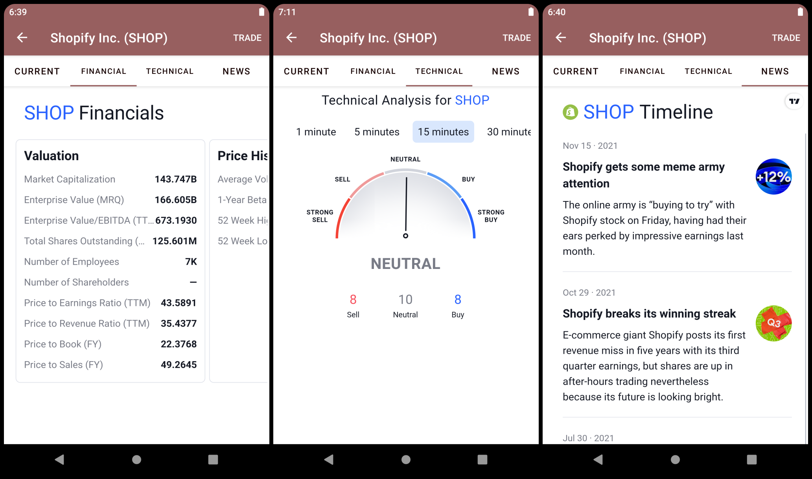
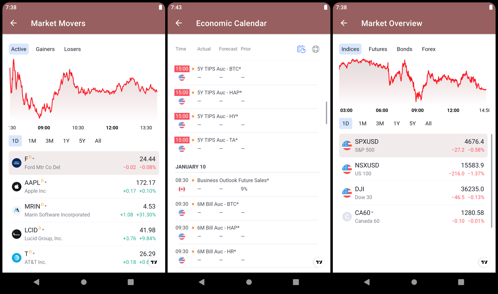
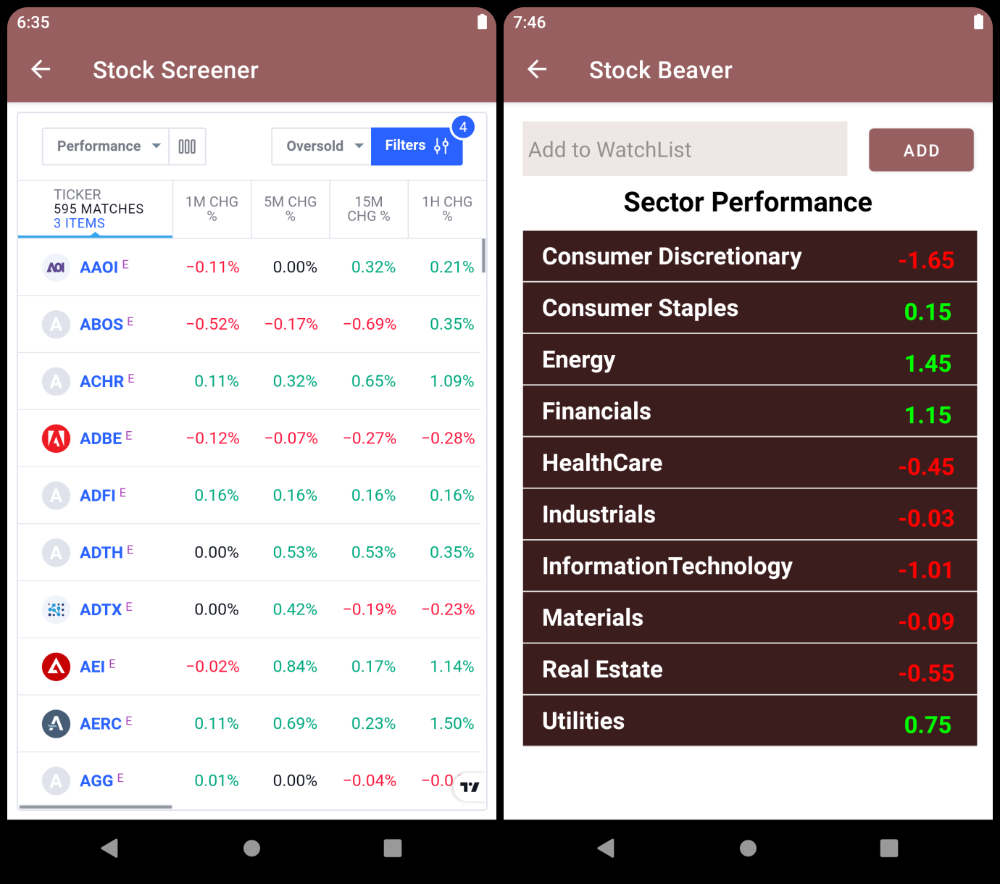

# Stock-Beaver
Stock Beaver - An android app to helps users track their favorite stock real in time.

## Stock Beaver
* User can build (add/delete) Watchlist - real time update.
* User can track their (add/delete/edit) portfolio - real time update.
* User can see sector performance.
* User can get detailed information about a single Company (fundamental analysis, technical analysis, news/timeline).
* User can search for a company.
* User can make an account and login.
---------------------------------------
* User can see market movers, winners, and losers.
* User can see market indexes.
* Advanced charting tools.
* Detailed stock chart.
* Company profile.
* Stock screener.

## Coming Soon
* User can add their friend and see their portfolio/paper trading performance.
* User can paper trade.

#### Registration/Login

#### Watchlist | Portfolio tracking | Advanced Charting tool

#### Company Profile | Main info page | Detailed Chart

#### Company Financials | Technical Analysis | News/Timeline

#### Market Movers | Economic Calendar | Market Overview

#### Stock Screener | Sector Performance

