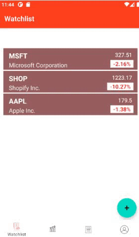
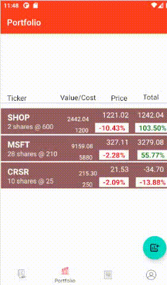
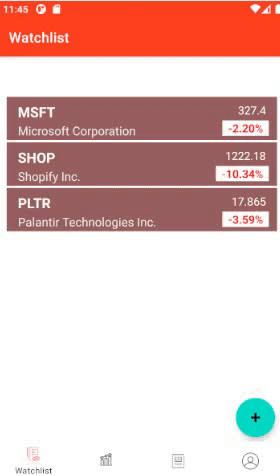

# Stock-Beaver
Stock Beaver - An android app to helps users track their favorite stock real in time.

## Stock Beaver
* User can build (add/delete) Watchlist - real time update.
* User can track their (add/delete/edit) portfolio - real time update.
* User can see sector performance.
* User can get detailed information about a single Company.
* User can search for a company.
* User can make an account and login.

## Coming Soon
* User can add their friend and see their portfolio/paper trading performance.
* User can paper trade.
* User can get more detailed information about a single Company (fundamental/technical anaylsis) and company news.
* User can see market movers, winners, and losers.
* User can see market indexes.

#### Registration/Login

| Add/Delete - Watchlist  | Add/Delete/Edit - Portfolio | View Company Info |
| ------------- | ------------- | ------------- | 
|  | |   | 

